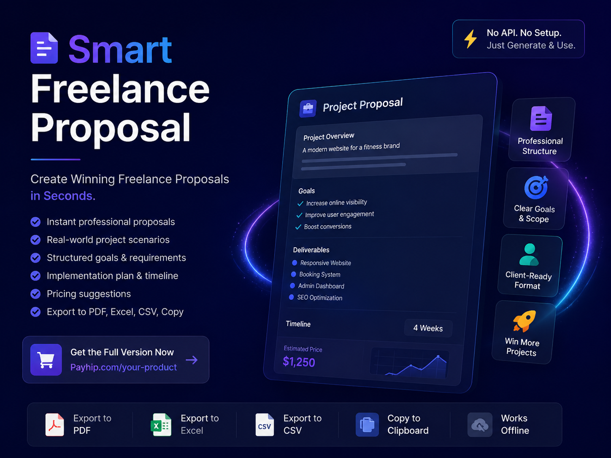
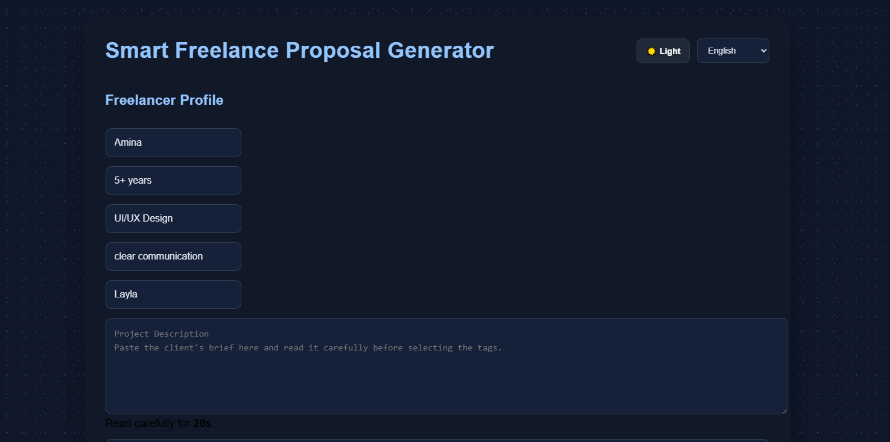
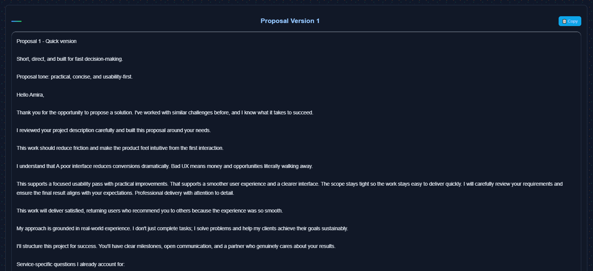

# Winning Proposal Intelligence System

## 🎯 ما هذه الأداة؟

نظام ذكي لإنشاء عروض أعمال فائزة للفريلانسرز. لا مزيد من القوالب العامة - ابنِ ثقة، لا قوالب!

## ✅ المميزات

### 🎯 نظام "لماذا تختارني"
اختر نقاط قوتك الحقيقية:
- ✓ الاتصال السريع
- ✓ سنوات الخبرة
- ✓ الانتباه للتفاصيل
- ✓ التسليم في الوقت المحدد
- ✓ ملف عمل ناجح
- ✓ محلل للمشاكل
- ✓ مناسب للميزانية
- ✓ منفتح للتعليقات
- ✓ دعم مخصص
- ✓ نهج الجودة أولاً

### 📋 مكتبة مخاوف العملاء
لكل خدمة (تصميم شعار، تطوير مواقع، إلخ)، نضمن لك:
- **الأسئلة التي يطرحها العملاء فعلاً**
- **إجابات افتراضية ذكية**
- **تخصيص سهل**

### 📦 نظام التسليمات
بدلاً من الوعود الغامضة، اظهر بالضبط ما سيحصلون عليه:

**تصميم الشعار يقدم:**
- 3-5 مفاهيم شعار فريدة
- وثيقة إرشادات العلامة التجارية
- تنويعات الشعار (أفقي، عمودي، أيقونة)
- مواصفات لوحة الألوان
- ملفات SVG وPNG للرقمية
- ملفات PDF جاهزة للطباعة
- جولات مراجعة غير محدودة

**تطوير المواقع يقدم:**
- موقع متجاوب بالكامل
- متوافق مع جميع المتصفحات
- سرعة تحميل سريعة (<3 ثوان)
- بنية محسّنة لمحركات البحث SEO
- شهادة SSL
- تصميم محمول أولاً
- دعم بعد الإطلاق (شهر واحد)

## 🚀 كيف تعمل؟

1. **إعداد الملف الشخصي**: املأ اسمك، سنوات الخبرة، مهارتك الرئيسية، وقوتك.
2. **اختر نقاط القوة**: قم بتمييز النقاط التي تنطبق عليك.
3. **اختر الخدمة**: اختر نوع خدمتك (تصميم شعار، تطوير مواقع، إلخ).
4. **عالج مخاوف العملاء**: شاهد الأسئلة الأكثر شيوعًا التي يطرحها العملاء لتلك الخدمة.
5. **اختر التسليمات**: شاهد بالضبط ما ستقدمه لهذه الخدمة.
6. **املأ التفاصيل الأخرى**: اسم العميل، نوع المشروع، النغمة، مستوى الجودة.
7. **إنشاء عرض عمل فائز**: انقر على "إنشاء عرض عمل فائز" لإنشاء 3 نسخ!

## 📊 ما يحتويه كل عرض؟

### النسخة السريعة
- تحية شخصية
- نقاط قوتك الرئيسية
- نقاط الألم للعميل
- نتائج المشروع
- خبرتك
- حلولك
- التسليمات
- خاتمة واضحة

### النسخة القياسية
- تحية شخصية
- لماذا تختارني
- ملفك الشخصي
- بيان المصداقية
- خبرة الخدمة
- نقاط الألم للعميل
- خبرتك
- حلولك
- نتائج المشروع
- إجابات للأسئلة الشائعة
- ما سيحصلون عليه (التسليمات)
- قيمة العميل
- نغمتك/نهجك
- تفاصيل نوع المشروع
- ضمانك
- خاتمة واضحة

### النسخة الفائزة/العالية الجودة
- تحية شخصية
- لماذا تختارني
- نقاط الألم للعميل (التأثير العاطفي)
- ما الذي يعنيه لهم
- نتائج المشروع
- لماذا أنت الخيار الصحيح
- خبرتك
- خبرة الخدمة
- حلولك
- إجابات للأسئلة الشائعة
- ما سيحصلون عليه (التسليمات)
- ضمانك
- قيمة العميل
- نغمتك/نهجك
- تفاصيل نوع المشروع
- خاتمة قوية

## 📸 لقطات الشاشة

## 🛒 شراء الأداة

جاهز لبدء إنشاء عروض أعمال فائزة؟ [اشتر الآن](BUY.md)

## 📞 للتواصل

- [رابط Payhip](https://payhip.com/Mockiva)
- البريد الإلكتروني: bibiskander725@gmail.com

---

**الفرق:**
هذا النظام يحول العرض من:
> "لدي 5 سنوات من الخبرة في تصميم المواقع وأنا أقوم بالتسليم بسرعة"

إلى:
> "ستحصل على موقع متجاوب بالكامل، بنية محسّنة لمحركات البحث SEO، سرعة تحميل سريعة تحت 3 ثوان، شهادة SSL، تصميم محمول أولاً، ودعم بعد الإطلاق لمدة شهر واحد. أجيب على التعليقات بسرعة، أقوم بالتسليم في الوقت المحدد، وأنتبه لكل تفاصيل."

**أحدهما يبدو عامًا. الآخر يبدو فائزًا.**

🏆 عروض أعمال سعيدة وفائزة!
